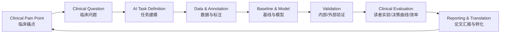

# AI Medical Application Guide

> 一个面向医学影像与临床科研场景的 AI 应用指南：从临床问题出发，完成任务定义、数据与标注设计、模型选择、验证评价、论文汇报与临床转化。

本仓库不再定位为“模型和数据集清单”，而是定位为一个 **临床问题 → AI 任务 → 可执行科研方案** 的结构化框架。它适合用于：

- 临床老师快速判断一个 AI 想法是否值得做；
- 医学影像 AI 学生/实习生启动课题；
- 多中心科研项目设计；
- 论文 Methods、Results 和补充材料的规范化准备；
- 医学 AI 项目的开题、答辩、基金申请和转化评估。

---

## 1. 核心理念

医学 AI 项目最常见的问题不是“不知道用什么模型”，而是：

1. 临床痛点没有被清楚定义；
2. AI 任务与临床决策场景不匹配；
3. 数据、标签、验证集和外部测试集设计不严谨；
4. 只报告模型指标，不证明临床价值；
5. 缺少可复用的项目文档、数据卡和模型卡。

因此，本指南采用下面的闭环框架：



一句话原则：**先问临床问题，再选 AI 任务；先设计验证，再训练模型。**

---

## 2. 仓库导航

```text
AI-Medical-Application-Guide/
├── README.md
├── docs/
│   ├── 00-start-here.md
│   ├── 01-problem-framing.md
│   ├── 02-data-and-annotation.md
│   ├── 03-task-taxonomy.md
│   └── 04-evaluation-and-statistics.md
├── templates/
│   ├── project-card.md
│   ├── dataset-card.md
│   └── model-card.md
├── examples/
│   ├── segmentation-lesion.md
│   ├── classification-diagnosis.md
│   └── dynamic-mri-workflow.md
└── resources/
    └── reporting-and-checklists.md
```

推荐阅读顺序：

1. [`docs/00-start-here.md`](docs/00-start-here.md)：如何使用本指南；
2. [`docs/01-problem-framing.md`](docs/01-problem-framing.md)：如何把临床痛点变成 AI 任务；
3. [`docs/03-task-taxonomy.md`](docs/03-task-taxonomy.md)：医学 AI 常见任务类型；
4. [`templates/project-card.md`](templates/project-card.md)：开题或带学生时直接填写；
5. [`docs/04-evaluation-and-statistics.md`](docs/04-evaluation-and-statistics.md)：如何设计验证与统计分析。

---

## 3. 临床问题到 AI 任务的映射

| 临床问题 | AI 任务 | 典型输出 | 常用模型/方法 | 关键评价 |
|---|---|---|---|---|
| 病灶/器官在哪里？ | 分割 Segmentation | mask、体积、形态参数 | U-Net、nnU-Net、SwinUNETR、SAM-style adaptation | Dice、IoU、HD95、体积误差 |
| 这个病例属于哪类？ | 分类 Classification | 类别、风险概率 | ResNet、DenseNet、EfficientNet、ViT、ConvNeXt | AUC、敏感度、特异度、校准 |
| 是否存在某个病灶？位置在哪里？ | 检测 Detection | bbox、中心点、候选结节 | Faster R-CNN、RetinaNet、YOLO、nnDetection | FROC、召回率、FP/scan |
| 某个连续临床指标是多少？ | 回归 Regression | 体积、评分、风险值、时间 | CNN/Transformer 回归、XGBoost、LightGBM | MAE、RMSE、R²、校准 |
| 缺失模态/低质量图像能否补全？ | 生成 Generation | 合成图像、增强图像 | GAN、Diffusion、VAE、CycleGAN | PSNR、SSIM、LPIPS、读者评分 |
| 不同时间/模态图像如何对齐？ | 配准 Registration | 变形场、配准图像 | VoxelMorph、SyN、deformable registration | TRE、Dice-after-registration、Jacobian |
| 影像和临床变量如何联合？ | 多模态 Multimodal | 综合风险、结构化报告 | late fusion、cross-attention、tabular+image model | AUC、NRI、DCA、亚组性能 |
| 报告文本如何结构化？ | NLP / Report AI | 标签、摘要、结构化字段 | BERT、LLM、RAG、规则+模型 | F1、准确率、一致性、人工审核 |

---

## 4. 一个医学 AI 项目的最小闭环

一个项目至少要回答 8 个问题：

1. **临床场景**：谁在什么情况下需要这个工具？
2. **目标人群**：纳入、排除标准是什么？
3. **参考标准**：标签来自病理、专家共识、随访，还是结构化报告？
4. **输入数据**：CT、MRI、超声、病理、文本、临床表格，是否多中心？
5. **AI 输出**：mask、类别、概率、体积、报告，还是工作流结果？
6. **验证设计**：训练/验证/内部测试/外部测试如何划分，是否按患者划分？
7. **临床价值**：是否提升诊断准确性、效率、一致性或可解释性？
8. **失败边界**：哪些病例不能用，哪些亚组风险更高？

---

## 5. 推荐工作流

### Step 1：填写项目卡

复制 [`templates/project-card.md`](templates/project-card.md)，先把临床问题写清楚，再决定模型。

### Step 2：定义数据与标签

复制 [`templates/dataset-card.md`](templates/dataset-card.md)，记录中心、设备、序列、标注者、纳排标准和数据划分。

### Step 3：选择任务类型

参考 [`docs/03-task-taxonomy.md`](docs/03-task-taxonomy.md)，不要把所有问题都粗暴写成“分类”或“分割”。

### Step 4：建立基线模型

优先建立一个稳定、可解释、可复现的 baseline，再尝试复杂模型。

### Step 5：验证临床价值

参考 [`docs/04-evaluation-and-statistics.md`](docs/04-evaluation-and-statistics.md)，尽量补充外部测试、校准、DCA、读者实验或工作流效率分析。

### Step 6：准备论文/开源材料

参考 [`resources/reporting-and-checklists.md`](resources/reporting-and-checklists.md)，同步准备 Methods、supplement、model card 和 dataset card。

---

## 6. 带学生/实习生的建议任务分层

| 层级 | 适合对象 | 目标 | 交付物 |
|---|---|---|---|
| S0 入门 | 新学生 | 跑通公开数据和 baseline | 可复现实验记录、baseline 指标 |
| S1 单任务 | 有基础学生 | 完成分割/分类/检测单任务 | 代码、结果表、失败病例分析 |
| S2 临床验证 | 研究生/核心学生 | 加入多中心、统计和读者实验 | 主结果表、补充表、论文 Methods |
| S3 工作流闭环 | 高阶项目 | 将多个模型串成临床流程 | 流程图、结构化报告、临床效率评价 |

---

## 7. 本仓库后续计划

- [ ] 增加医学影像公开数据集索引；
- [ ] 增加常见论文 Methods 模板；
- [ ] 增加 reader study 设计模板；
- [ ] 增加多中心验证与统计代码示例；
- [ ] 增加医学 AI 项目开源规范示例；
- [ ] 增加动态 MRI / 多阶段工作流案例。

---

## 8. 使用提醒

本仓库仅用于科研设计、教学和项目管理，不构成医疗建议，也不能替代医生判断。任何面向临床使用的 AI 系统都需要经过伦理审批、数据安全审查、充分验证和相应监管流程。
